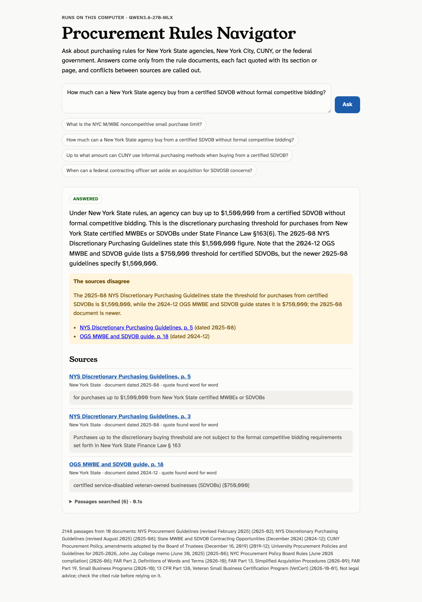
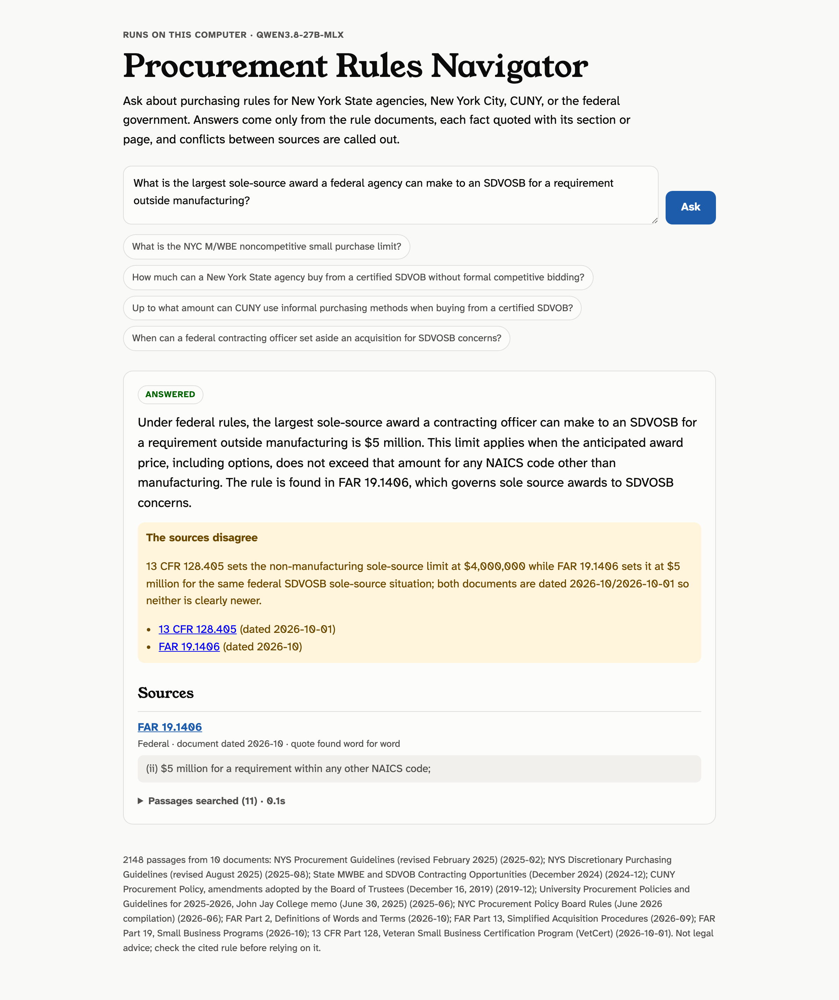

# Procurement Rules Navigator

Ask a question about purchasing rules for New York State agencies, New York City, CUNY or the federal government. You get a short answer drawn only from the rule documents, each fact quoted with its section or page. When two sources disagree, the answer says so and gives the date of each.

It runs on a local open-weight model by default, so questions and documents stay on the machine.

**Sample answers (saved, nothing runs): https://howlshot.github.io/procurement-rules-navigator/**



## Two answers that show what it is for

**"What is the NYC M/WBE noncompetitive small purchase limit?"** The NYC rule, PPB Rules § 3-08(c)(1)(iv), gives no figure. It points to "the maximum amount authorized pursuant to paragraph (1) of subdivision (i) of section 311 of the Charter". The navigator follows that reference to Charter § 311(i)(1) and answers $1,500,000, quoting both. The same PDF also contains a table of past amendments that says $500,000; the answer flags it as history, not the rule in force.

**"How much can a New York State agency buy from a certified SDVOB without formal competitive bidding?"** $1,500,000, quoted from the NYS Discretionary Purchasing Guidelines revised August 2025. It also flags that the OGS "State MWBE and SDVOB Contracting Opportunities" guide from December 2024 still says $750,000, and that the guidelines are newer. Both public documents are linked from this repository, so you can check.

## How it works

```
sources/manifest.json   10 public documents: links, publishers, dates
navigator/sources.py    PDF, FAR web pages and eCFR XML into passages that keep their section and page
navigator/search.py     keyword (BM25) plus embedding search, fused by rank; follows cross-references
navigator/answer.py     the model answers from numbered passages; every quote is checked
navigator/server.py     local web page
scripts/run_eval.py     the evaluation in eval/
```

- **Citations people can check.** Passages keep the section they came from: FAR 19.1405, 13 CFR 128.306, NYC PPB Rules § 3-08, NYC Charter § 311. PDF citations carry the page, and each links to the source.
- **Hybrid search.** Keyword ranking catches exact terms such as "micropurchase" and "§ 3-08". Embeddings, from a local nomic-embed model, catch the same idea in other words. The two lists are combined by rank, so neither score has to be tuned against the other.
- **Cross-references are followed.** When a passage sets a number by pointing elsewhere ("section 311 of the Charter", "see 19.1406"), the referenced passage is added, narrowed to the named subdivision.
- **History is kept in its place.** Tables of past amendments are labelled as history and ranked below the rule in force.
- **Definitions are found.** For "what is the X", passages that say "X means" are pulled in, so the simplified acquisition threshold comes from its FAR 2.101 definition.
- **Quotes are checked.** The model must quote 8 to 40 words from each passage it relies on. A quote not found in its passage is removed. An answer left with no checked quote is marked unsupported, not shown as fact.
- **Newer documents win, and stale figures are caught.** Within a jurisdiction, newer documents are listed first and the model is told to answer from them. A code check also flags any answer whose dollar figure appears only in an older document, when a newer cited document gives a different one.
- **"Not found" is an answer.** Questions the sources do not cover get a plain "not in these sources", not a guess.

## Results

30 test questions ([`eval/questions.json`](eval/questions.json)), with answers checked against the source text.

| Measure | Result |
|---|---:|
| Answers correct | 27/27 |
| Right document cited, quote checked | 27/27 |
| Out-of-scope questions answered "not found" | 3/3 |
| Real conflicts flagged | 2/2 |
| False conflict flags | 0 |
| Search alone, right passage on top | 19/27 |

Both conflicts are in current public documents:
- **NYS SDVOB limit:** OGS guide (Dec 2024) says $750,000; the 2025 guidelines say $1,500,000.
- **Federal SDVOSB sole-source cap:** FAR says $5 million; SBA's 13 CFR 128.405 still says $4 million.



Caveats: a small question set, written by the builder, and the search was tuned on it. Earlier runs scored 93–96%.

Details: [`eval/RESULTS.md`](eval/RESULTS.md) and [`answers/`](answers).

## Models tested

| | Qwen 3.8 27B (LM Studio) | Qwen3.8-Flash-Next (mlx-serve) |
|---|---:|---:|
| Answers correct | 27/27 | 27/27 |
| Real conflicts flagged | 2/2 | 2/2 |
| False conflict flags | 0 | 0 |

Same results. The sample answers use the 27B. Flash-Next results: [`eval/flash-next/`](eval/flash-next).

## Run it

You need Python 3.11 or later, poppler (`brew install poppler`), and [LM Studio](https://lmstudio.ai) or another OpenAI-compatible server with a chat model and an embedding model. Load both, so the server does not swap them in and out:

```bash
lms load qwen3.8-27b-mlx
lms load text-embedding-nomic-embed-text-v1.5
python3 scripts/fetch_sources.py      # downloads the 10 public documents
python3 -m navigator build            # passages and embeddings, about 10 seconds
python3 -m navigator ask "What is the NYC micropurchase limit for construction?"
python3 -m navigator serve            # web page on http://127.0.0.1:8766
```

For mlx-serve, pass `--base-url http://127.0.0.1:1237/v1 --model <id>`, set `JSON_SCHEMA_MODE=prompt` (its schema-enforced output is about 7 times slower), and point `--embed-url` at any server running the nomic embedding model.

`--provider anthropic` uses a hosted model for answers when `ANTHROPIC_API_KEY` is set; search still uses the local embeddings. The published results do not use it.

Tests need no model: `python3 -m unittest discover -s tests -t .`

## Sources

| Document | Jurisdiction | Dated |
|---|---|---|
| NYS Procurement Guidelines | New York State | February 2025 |
| NYS Discretionary Purchasing Guidelines | New York State | August 2025 |
| OGS State MWBE and SDVOB Contracting Opportunities | New York State | December 2024 |
| CUNY Procurement Policy (Board of Trustees amendments) | CUNY | December 2019 |
| CUNY 2025-26 procurement guidelines memo (John Jay College) | CUNY | June 2025 |
| NYC Procurement Policy Board Rules, with Charter Chapter 13 | New York City | June 2026 compilation |
| FAR Parts 2, 13 and 19 | Federal | acquisition.gov, September and October 2026 |
| 13 CFR Part 128 (VetCert) | Federal | eCFR, October 1, 2026 |

Links are in [`sources/manifest.json`](sources/manifest.json). The documents are not copied into this repository.

## Limits

- Answers are only as current as the documents. The CUNY policy is from 2019, and the statutes themselves (State Finance Law § 163, the NYC Charter outside Chapter 13) are not included beyond what these documents reproduce.
- This is a research aid, not legal advice. Check the cited rule before relying on an answer.
- The saved sample answers replace names, emails and phone numbers with placeholders.

## About

Built by [Studio Chingie LLC](https://studiochingie.com/services), a service-disabled veteran-owned small business that builds custom software, document search and AI tools for government and business. Code under the [MIT License](LICENSE).
